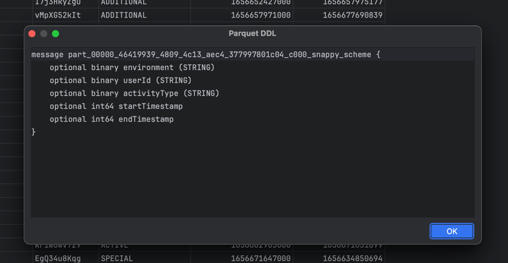
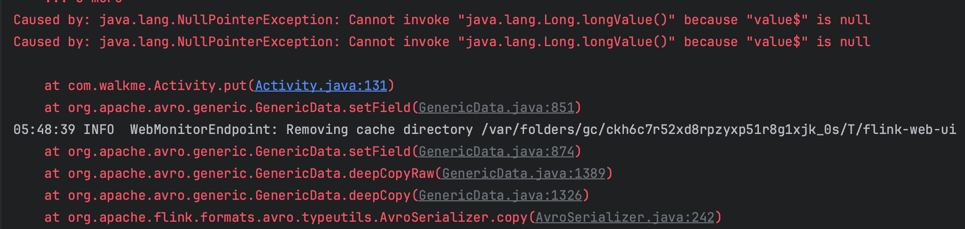

# Walkme Take Home Assignment

You are given a list of Avro Parquet with the schema described in the following [file](src/main/avro/schema.avsc).

Files represent some user activity. Activities have the following constraints:

* `userId` uniquely describes user
* `environment` describes an id of environment that given user had activity on
* `activityType` is an optional field that describes type of the particular activity it can be one
  of `IDLE`, `ACTIVE`, `SPECIAL`, `ADDITIONAL`.
* `startTimestamp` describes epoch timestamp of the activity start
* `endTimestamp` optional field describes epoch timestamp of the activity end
* All activities are tied to particular day, which means that if given activity has no `endTimestamp`, it is assumed to
  be end of day.

## Existing Architecture

You can assume that there is an existing HTTP API with the following endpoint:

```agsl
GET /testEnvironments/{userId}
```

If the `userId` has any test environments defined endpoint will return the JSON describing the test environment,
otherwise it will return `404`.

The JSON response from the endpoint is as follows:

```
{
 "userId": String,
 "environment": String,
 "activeFrom": String
 "activeUntil": String
}
```

Each test environment is automatically promoted to production environment after `activeUntil` and after that time it
should not be considered test anymore.
Similarly, before `activeFrom` environment should not be considered as test environment.

Both `activeFrom` and `activeUntil` are dates in format "YYYY-mm-DD"

To run the Test API for the provided test data You can use the [script](start-api.sh).You can check that the
api works by using `GET /testEnvironments/161xyVtzx3`.

```shell
http GET localhost:8080/testEnvironments/161xyVtzx3
```

```
HTTP/1.1 200
Content-Type: application/json;charset=UTF-8
Date: Wed, 25 Oct 2023 16:00:58 GMT
Transfer-Encoding: chunked

{
    "activeFrom": "2022-02-23",
    "activeUntil": "2023-02-24",
    "environment": "third",
    "userId": "161xyVtzx3"
}
```

## Goal

Your goal is to create a batch job in Spark/Flink or any other distributed framework of Your choice.
Example data that has the same formatting and partitioning as the original data can be found [here](data).

The requirements are as follows:

1. The job should calculate daily activity aggregates for every user per environment and write them to a specified
   output
   path.
2. The job should work for specified date range.
   under Java 172. The job should ignore the activities that happened in **active** test environments.
3. The job might be used by different departments that care about different activity types, so the job should have
   the possibility to ignore one or more activity types based on configuration.

## What matters

For this task, what matters the most is to have a properly designed pipeline with good code quality and error handling
with
some level of testing. It's not required to overdo the tests though.

If You feel there is something that can be done better, but it would require a lot of time, feel free to add a writeup
in
ReadMe about this.

# Discussing solution

## Personal Goals

Venturing into the world of Flink for the first time, my primary objective is to learn and grow. I view these
recruitment tasks as valuable learning opportunities and consistently share my experiences
on [my GitHub](https://github.com/pleszczy).

## How to run

Using default input/output data paths

```shell
./gradlew run --args="--excludedActivityTypes ACTIVE,IDLE"
```

Overriding input/output data paths

```shell
./gradlew run --args="--excludedActivityTypes ACTIVE,IDLE --input /data --output /output/daily-activity"
```

## Requirements

- JDK 17

## Implementation Details and Notes

### 1. Avro vs Parquet Schema Mismatch
- **Issue**: The `AvroSerializer` mapped the activity column value to the `startTimestamp` column incorrectly.
- **Root Cause**: Differences in the structures of Avro and Parquet schemas.
- **Resolution**: Revised the Avro schema to align with the Parquet schema.
  
  
  

### 2. Anomaly in Default Value for `endTimestamp`
- **Issue**: The Avro schema assigned a string "null" as the default for `endTimestamp`.
- **Resolution**: Updated the Avro schema to designate the genuine `null` value.

### 3. Compatibility of Java 17 with Flink
- **Issue**: Issues arise from Flink's reflection-based serialization of UDFs and data via Kryo when using JDK classes.
- **Resolution**: Granted access to essential JDK classes using VM options, for example: `--add-opens java.base/java.lang=ALL-UNNAMED`.

  

### 4. Persistent Retry Issue with OkHttp3
- **Issue**: OkHttp3 keeps retrying indefinitely when an API is down.
- **Resolution**: Currently, no resolution is identified. The strict module system of Jigsaw is under suspicion.

### 5. Kryo Serializer Limitation with Java Records
- **Issue**: Kryo serializer lacks support for Java records.
- **Resolution**: While record support was introduced to Kryo in a [recent update](https://github.com/EsotericSoftware/kryo/pull/766), Flink uses an older version. As a remedy, the Kryo dependency was updated.

`java.lang.IllegalArgumentException: Unable to create serializer "com.esotericsoftware.kryo.serializers.FieldSerializer" for class: com.walkme.usecases.AggregateDailyActivitiesUseCase$AggregateActivity`

### 6. Lambda Function Limitations with Java Generics
- **Issue**: The concise lambdas are less preferable due to insufficient type information they provide, especially when Java generics are in play.
- **Resolution**: There isn't a definitive solution yet. Using value objects in place of generic Tuples is a potential workaround.
- **Resources**: [Flink Documentation](https://nightlies.apache.org/flink/flink-docs-release-1.19/docs/dev/datastream/java_lambdas/)

### 7. Activity Duration Scope
- **Note**: It's essential to ascertain if an activity can span multiple days. If restricted to a single day, it allows for a more streamlined logic and optimizes computation.

### 8. Null Activity Type Handling
- **Note**: Activities with `null` types are mapped to "UNKNOWN" to facilitate the filtering process.

### 9. Multiple File Outputs with a single row after migration to Parquet format
#### Issue Description
After transitioning from CSV to Parquet file formats, an unexpected behavior occurred where multiple Parquet files are created for each day with only one record per file. This contrasts with the previous CSV implementation where a single file was created per day using `keyBy(date)` and the files contained multiple records.

#### Attempted Resolutions
Efforts to consolidate file output into fewer files, such as enforcing a `SizeBasedFileRollingPolicy` and setting `setParallelism(1)`, did not yield the expected results. The problem persists, suggesting that the issue might not stem from file rolling policies or parallelism configurations.

#### Ongoing Investigations
- **Java Version Suspicions**: There is an ongoing suspicion that the serialization anomalies could be related to Java 17, necessitating further investigation into the Java serialization mechanisms involved.
- **Integration Testing**: An integration test for the `WriteOutputData` use case was implemented. However, this test has not successfully replicated the problematic behavior.

#### Next Steps
- Add additional integration tests
- Consult with the Apache Flink user community or raise a ticket with detailed logs and setup configurations (java 17 support is experimental so I wouldnt count on much help here)

**Action Required**: This item remains open and requires further investigation.


## Project Structure Overview

This project aspires to adhere to the `Clean Architecture` principles. However, due to time constraints, its
implementation is still ongoing and not yet complete.

### `src/mainavro`

Houses AVRO schemas.

#### `adapters`

Interfaces with external frameworks and libraries, ensuring decoupling of core application logic from specific external
implementations.

##### `frameworks`

- **flink**: Contains classes related to the Flink framework.
- **jackson**: Holds configurations for the Jackson library.
- **okhttp3**: Configuration and utility classes for OkHttp3.
- **resilence4j**: Configurations and classes for the Resilience4j library.

#### `repositories`

Handles data abstraction, whether from databases, file systems, or other external sources.

#### `common`

Utilities and helpers for the application like `TimeUtils`.

#### `entities`

Encapsulates the core business logic and domain.

- **ActivityAccumulator**: Represents accumulated activities over certain criteria.
- **Environment**: Represents a test environment.

#### `exceptions`

Central hub for all custom exceptions.

- **FetchEnvironmentException**: Thrown for issues retrieving environment data.

#### `use-cases`

Holds application-specific operations and business rules.

- **AggregateDailyActivities**: Use-case for aggregating daily activities.
- **CalculateDailyActivityAggregates**: Use-case for the calculation of daily activity aggregates.
- **FilterOutActivitiesInActiveTestEnvironment**: Use-case for filtering activities in active test environments.
- **FilterOutExcludedActivityTypes**: Use-case for the filtering specific activity types based on input criteria.

### Root Level

- **App**: Main application class.
- **AppModule**: Application module configurations.